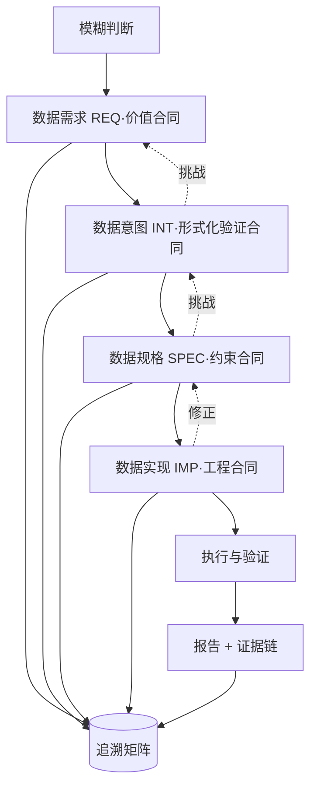

# 四层形式化数据智能体 —— 设计

> 依据工作论文《从模糊判断到可复现证据：数据智能体的四层形式化工程方法论》（主仓 `docs/essay/intro/index.md`）设计。
> 本文档定义这个智能体**生成什么、如何生成、如何管理**，以及如何保证「可追溯、可证伪、可复现」。

## 一、定位

四层形式化数据智能体（下称「智能体」）把一个模糊判断，转成四层合同及其可执行产物：

> 模糊判断 → 数据需求（价值合同）→ 数据意图（形式化验证合同）→ 数据规格（约束合同）→ 数据实现（工程合同）

它不是查询执行器，而是形式化验证器：不直接回答「搜索次数是多少」，而是先澄清「搜索行为是什么、凭什么说它低效」，再定义指标、登记可证伪命题、执行验证，最后给出可回指的证据链。

## 二、输入与输出

**输入**

| 项 | 说明 |
|:--|:--|
| 模糊判断 | 一句业务问题，如「多个智能体的搜索行为不稳定」 |
| 数据源 | 可用来源、位置、格式、访问方式 |
| 约束 | 权限、合规、算力、时间 |

**输出**

| 项 | 说明 |
|:--|:--|
| 四层合同 | `REQ` / `INT` / `SPEC` / `IMP` 四份受版本管理的 Markdown |
| 可执行工程 | 采集、清洗、分析、验证、报告的代码与命令行 |
| 验证结论 | 每个命题的检验统计量、p 值、效应量、置信区间 |
| 追溯矩阵 | 业务成功指标 ← 规格指标 ← 命题 ← 报告章节 |

## 三、总体架构



三条不变量贯穿全链：**结论必回指**、**未识别不冒称因果**、**实现不重定义**。

## 四、生成：四层生成器

每一层是一个「生成器」，有固定的输入、动作、产物、门禁与回退。生成以 LLM 起草，但每层都设有**结构化门禁**与**人工确认**：LLM 提议，人裁决。

### 4.1 数据需求生成器（价值合同）

| 环节 | 内容 |
|:--|:--|
| 输入 | 模糊判断、业务上下文、数据源与约束 |
| 动作 | 澄清痛点；写目标与非目标；给**业务口径**成功指标；定范围；列利益相关者与约束 |
| 产物 | `REQ-*.md` |
| 门禁 | 成功指标必须是业务后果而非交付物；范围可界定；约束齐全 |
| 挑战 | 向需求方确认；成功指标只写「产出报告」则拒绝进入下一层 |

### 4.2 数据意图生成器（形式化验证合同）

| 环节 | 内容 |
|:--|:--|
| 输入 | `REQ` |
| 动作 | 界定形式化对象；给每个概念的操作定义；建立指标；提出命题与可证伪条件；画因果图；列约束与不变量；定验证方法；预留验证结论 |
| 产物 | `INT-*.md` |
| 门禁 | 每个概念有操作定义；每个命题有可证伪条件；相关命题与因果命题分列 |
| 挑战 | 若判断无法形式化（概念无法界定），退回 `REQ` 重新界定问题 |

### 4.3 数据规格生成器（约束合同）

| 环节 | 内容 |
|:--|:--|
| 输入 | `INT` |
| 动作 | 定数据源与采集规则；清洗与归一化规则；表结构；指标计算口径；流程步骤（输入 / 规则 / 产物 / 验收）；质量校验；追溯矩阵 |
| 产物 | `SPEC-*.md` + 表结构定义 |
| 门禁 | 每个指标可计算；每个流程步骤有验收标准；命名与口径唯一 |
| 挑战 | 暴露 `INT` 中不可计算的定义，退回 `INT` 修正 |

### 4.4 数据实现生成器（工程合同）

| 环节 | 内容 |
|:--|:--|
| 输入 | `SPEC` |
| 动作 | 生成采集、清洗、分析、验证、报告的代码与命令行；生成质量校验脚本；纳入版本管理 |
| 产物 | 可执行工程 + `IMP-*.md` |
| 门禁 | 所有定义来自 `INT`，所有约束来自 `SPEC`；不得另立定义或另设流程 |
| 挑战 | 实现中发现规格欠妥，回改 `SPEC` 而非就地绕行 |

## 五、管理：产物仓库、版本与状态

### 5.1 工作空间布局

每个案例一个工作空间，四层产物与数据、代码、报告分列：

```
workspace/<case>/
├── docs/                 # 四层合同（REQ / INT / SPEC / IMP）
│   ├── requirement.md
│   ├── intent.md
│   ├── specification.md
│   └── implementation.md
├── data/
│   ├── raw/              # 采集原始区
│   ├── clean/            # 四张事实表
│   └── report/           # 指标 JSON 与报告
├── code/                 # 可执行工程
├── verify/               # 检验结果
└── manifest.json         # 版本、时间戳、各步行数与计数
```

### 5.2 追溯 ID

- 命名：`REQ-001 → INT-001 → SPEC-001 → IMP-001`
- 每个具体断言的 ID 可挂在层级 ID 下，如 `INT-001-H2`（第二个命题）。
- 追溯矩阵双向可查：给定报告结论，可回溯到命题 → 指标 → 需求。

### 5.3 版本与状态

- 每份产物带版本与时间戳；数据、代码、报告各自记版本。
- 产物状态机：`draft`（起草）→ `validated`（过门禁）→ `executed`（已执行）→ `failed`（验证未过）。
- 任一层变更，下游层标记为 `stale`，触发再生成。

### 5.4 挑战与回退

任何一层都可以反向挑战上一层：

| 挑战 | 触发 | 结果 |
|:--|:--|:--|
| `INT` 挑战 `REQ` | 判断无法形式化 | 退回 `REQ` |
| `SPEC` 挑战 `INT` | 定义不可计算 | 退回 `INT` |
| `IMP` 挑战 `SPEC` | 规格自相矛盾或缺验收 | 退回 `SPEC` |

每次挑战记录「触发点 → 结论 → 改动」，形成可追溯的迭代史。

## 六、验证执行

- 对每个命题执行统计检验，产出检验统计量、p 值、效应量与置信区间。
- 可行时做因果识别（A/B、反事实、断点回归）；不可识别时**只报相关**，禁止冒称因果。
- 检验结论登记回 `INT` 的「验证结论」；未达验收清单则产物停在该层 `failed`，不得进入报告。

## 七、命令行接口

以独立命令 `qtcloud-data-lab` 交付，避免与正式 `qtcloud-data` 冲突：

```text
qtcloud-data-lab req        new|update|show            # 数据需求
qtcloud-data-lab intent     new|update|show            # 数据意图
qtcloud-data-lab spec       new|update|show            # 数据规格
qtcloud-data-lab impl       new|update|show            # 数据实现
qtcloud-data-lab run        [<step>...]                # 执行数据规格定义的步骤（缺省全链）
qtcloud-data-lab trace      [--claim <id>]             # 查追溯矩阵（可反向查结论）
qtcloud-data-lab refute     <from-layer> <to-layer>    # 反向挑战（下游证伪上游）
qtcloud-data-lab status     [--case <name>]            # 各层状态与版本
```

### 大模型接入

分层依赖：`packages/rust`（`quanttide-data-lab`，data 库）**不依赖** `quanttide-agent`——四层领域模型保持纯净，无 LLM 耦合；`src/cli`（`qtcloud-data-lab`）负责**组装** data 库与 agent 库，LLM 只在 CLI 层接入。

`req` / `intent` / `spec` / `impl` 的 `new` 起草等生成动作，由 CLI 调用 `quanttide-agent` 完成。本机已配置小米 MiMo 的 API 密钥，可直接联调。

接入要点：依赖 `quanttide-agent >= 0.1.2`（`0.1.1` 尚无 MiMo 支持）；该库读取 `MIMO_API_KEY`（本机现有 `XIAOMI_API_KEY`，需再导出同值的 `MIMO_API_KEY`）、`MIMO_MODEL`（默认 `mimo-v2.5`）与 `MIMO_BASE_URL`（默认 `https://api.xiaomimimo.com/v1`）。

## 八、不变量（质量保证）

1. 报告结论必须回指到具体指标与命题，不得由模型自由生成。
2. 未识别因果关系的，不得冒称因果。
3. 每个指标可由清洗产物一键复算，数值一致。
4. 成功指标必须是业务后果，不是交付物。
5. 实现层不重新定义概念、不重新解释指标、不另立流程。

任何一条被违反，对应产物不得标记为 `validated`。

## 九、与「量潮搜索工程」案例的映射

| 层 | 案例中的产物 |
|:--|:--|
| REQ | 搜索相关失败率下降、任务成功率提升等业务指标 |
| INT | 形式化对象、操作定义、指标、命题 `H1–H3`、因果图、验证方法与结论 |
| SPEC | 6 个来源的采集规则、四张表 `sessions/messages/tool_calls/search_events`、五步流程与质量校验 |
| IMP | Python + polars + Parquet、命令行 `run`（`load`/`clean`/`analyze`/`verify`/`report`）、报告生成 |

该案例即智能体的验收基准：能从头生成这四层，并复现其验证结论。

## 十、失败模式与对策

| 失败模式 | 对策 |
|:--|:--|
| 概念未澄清就进入指标 | `INT` 门禁拦截，退回 `REQ`/`INT` |
| 指标不可计算 | `SPEC` 挑战 `INT`，修正定义 |
| 结论无法回指 | 报告发布门禁拒绝 |
| 因果不可识别 | 降级为相关，明确标注 |
| 生成代码偏离规格 | 代码评审对照 `SPEC` 验收项 |

## 十一、里程碑

1. **M1 单层可生成**：四层生成器各自产出过门禁的产物。
2. **M2 全链可追溯**：四层贯通，追溯矩阵双向可查。
3. **M3 验证可执行**：`verify` 自动产出检验结论并回填 `INT`。
4. **M4 跨案例泛化**：在第二个数据工程案例上复现（如问卷清洗）。

---

> 不是查数，是建构可验证的认知。不是给答案，是给一条可检验的认知链。
